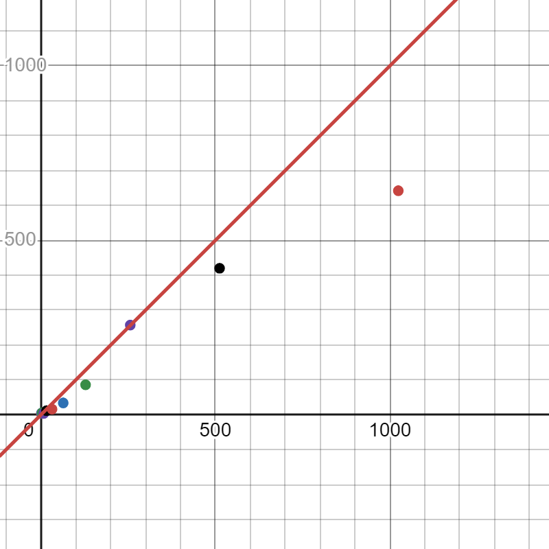

# Blockchain

## Pseudo-kodas

### Main funkcija:

Pradžia 
Nustatyti įvestį 
Kviesti hash_function(input) ⟶ (gauti įvesties eilutės maišos vertę) 
Atspausdinti "Maiša: [hash_function rezultatas]" 
Pabaiga 

### Funkcija hash_function(input)

Inicijuoti state[8] ⟶ (inicijuoti būseną pradinėmis konstantomis) 
Kviesti padding(input) ⟶ (gauti užpildytą pranešimą) 
Ciklas per kiekvieną 64 baitų bloką iš užpildyto pranešimo: 
Kviesti process_block(state, block) ⟶ (atnaujinti būseną kiekvienam blokui) 
Konvertuoti galutinę state[8] reikšmę į šešioliktainį skaičių 
Grąžinti šešioliktainę eilutę kaip galutinį maišos rezultatą 

### Funkcija initialize(state)

Nustatyti state[0...7] į iš anksto nustatytas konstantas 
Grąžinti 

### Funkcija padding(input)

Apskaičiuoti visą ilgį, reikalingą užpildymui ⟶ (įtraukti 1 bitą + užpildymą + 8 baitus ilgiui) 
Paskirti atmintį padded_input 
Kopijuoti pradinį input į padded_input 
Pridėti 0x80 bitą (1, po kurio eina 7 nuliai) po įvesties 
Pridėti nulius, kad ilgis būtų suderintas su 512 bitų daugikliu 
Pridėti pradinio input ilgį (bitais) kaip 64 bitų sveikąjį skaičių 
Grąžinti padded_input ir padded_length 

### Funkcija process_block(state, block)

Paruošti pranešimo masyvą W[64]: 
Pirmieji 16 žodžių (1 žodis - 4 ASCII simboliai) iš block 
Kiti 48 žodžiai gaunami naudojant ankstesnius žodžius 
Inicijuoti kintamuosius a, b, c, d, e, f, g, h iš state[0...7] 
Ciklas 64 kartus: 
Apskaičiuoti S1, ch, temp1, S0, maj, temp2 
Atnaujinti a, b, c, d, e, f, g, h 
Atnaujinti state[0...7] su a, b, c, d, e, f, g, h 
Grąžinti 

## Eksperimentinis tyrimas ir rezultatų analizė

| File Name | Generated Hash |
| --- | --- |
| one_symbol1.txt | 68d3abfaf7276d0d837cd8a0a2a331483587736c9acce6d771c8e3674fa07c10 |
| one_symbol1.txt | 68d3abfaf7276d0d837cd8a0a2a331483587736c9acce6d771c8e3674fa07c10 |
| one_symbol2.txt | b521d09e2696fb0d3afc9d28f53ea1896a080374608570c1971f1558ab01e7b5 |
| random_symbols1.txt | e124bece0067856015fa813b10e42570d154bf2ecb792f27fe5603499793ca1d |
| random_symbols2.txt | 5ad8f8b4e0054df829e860f795cc1db3428d853a52306c9824502065aff7be21 |
| one_difference1.txt | 3de8903576b042a674cf574011e70e75bb85e7de15788e6e4da4e17cca0b1c0d |
| one_difference2.txt | 8dbee927c4b18e48fa5042b9f1f94c1fbe0c6324c243f7fe79505d2e7d974808 |
| empty.txt | 06d3ff0726e3e0b1f584f9c4411033a26758368f5a7e9f17006a0e5878fead43 |

### Laiko matavimas

| Line Count | Time (μs) |
| --- | --- |
| 1 | 4 |
| 2 | 5 |
| 4 | 6 |
| 8 | 4 |
| 16 | 12 |
| 32 | 16 |
| 64 | 34 |
| 128 | 86 |
| 256 | 257 |
| 512 | 420 |
| 1024 | 642 |

Iš aukščiau pavaizduoto grafo galime spręsti, jog maišos algoritmo sudėtingumas yra panašus į tiesinį.

### Kolizijų paieška

| Kolizijų kiekis |
| --- |
| 0 |

Testavimo metu su 100 tūkstančių porų duomenų failu nebuvo rastas nei vienas kolizijos atvejis.